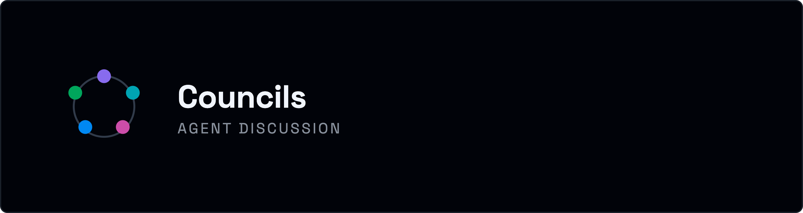
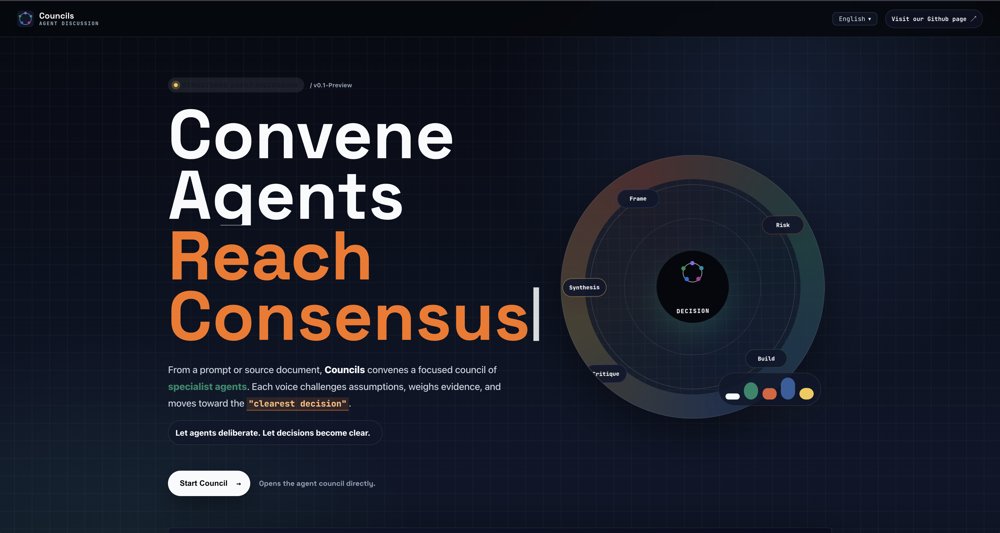

# Councils: Agent Discussion

<p align="center">
  
</p>



Councils is a local-first multi-agent discussion workspace. It lets several Ollama or OpenRouter-backed agents frame a question, challenge assumptions, invite missing specialists, visualize the discussion graph, and synthesize a final answer.

**Demo:** [Sample demo URL coming soon](https://example.com)

## About The Agent Workspace

Councils is built around a simple idea: useful agent systems should make disagreement, memory, and influence visible. Instead of hiding a multi-agent workflow behind one final answer, Councils shows the council forming in real time: agents join, speak to each other, create edges in a graph, and converge toward a recommendation.

The current prototype includes:

- A dark animated landing page with Councils branding.
- A React playground for live agent discussion.
- Server-sent event streaming from a Node/Express orchestrator.
- Local Ollama model discovery.
- OpenRouter support for free models only.
- Dynamic specialist creation through `INVITE:` lines.
- A visible agent graph powered by `@xyflow/react`.
- A reflective simulated inner-state pass for each agent before it speaks.

## Branding

Primary logo assets live in `src/assets/logo/`:

- `councils-icon-light.png`
- `councils-icon-dark.png`
- `councils-logo-full-dark.png`
- `councils-wordmark-dark.png`
- `landing.png`

## Quick Start

```bash
npm install
npm run dev
```

Open [http://localhost:5173](http://localhost:5173).

The web app runs on `5173`. The API runs on `8787`.

## Setup With Ollama

1. Install Ollama from [ollama.com](https://ollama.com/).
2. Start Ollama locally.
3. Pull at least one chat model:

```bash
ollama pull qwen3:8b
ollama pull llama3.2:latest
```

4. Run Councils:

```bash
npm run dev
```

By default, the backend expects Ollama at:

```bash
http://127.0.0.1:11434
```

Override it if needed:

```bash
OLLAMA_URL=http://127.0.0.1:11434 npm run dev
```

When the app opens, the Model dropdown only shows local Ollama models if the Ollama API is reachable.

## Setup With OpenRouter

Councils supports OpenRouter with a free-model guard. By default, OpenRouter choices only appear when `OPENROUTER_API_KEY` is set.

Create either `.env` in the project root or `server/.env`:

```bash
OPENROUTER_API_KEY=sk-or-your-key
```

Then run:

```bash
npm run dev
```

Default OpenRouter free choices:

```text
openrouter/free
inclusionai/ling-3.0-flash:free
poolside/laguna-s-2.1:free
nvidia/nemotron-3-ultra-550b-a55b:free
google/gemma-4-26b-a4b-it:free
```

Optional OpenRouter settings:

```bash
OPENROUTER_FREE_MODELS=openrouter/free,inclusionai/ling-3.0-flash:free,poolside/laguna-s-2.1:free,nvidia/nemotron-3-ultra-550b-a55b:free,google/gemma-4-26b-a4b-it:free
OPENROUTER_BASE_URL=https://openrouter.ai/api/v1
OPENROUTER_SITE_URL=http://localhost:5173
OPENROUTER_APP_NAME="Councils Agent Discussion"
```

`openrouter/auto-beta` is intentionally excluded from the default list because it can route to paid models. The backend allows `openrouter/free` and model IDs ending in `:free`.

## Development Commands

```bash
npm run dev        # start web + API
npm run dev:web    # start Vite only
npm run dev:server # start Express API only
npm run build      # TypeScript + production build
npm run lint       # oxlint
```

## Architecture

The current prototype is intentionally small:

- `src/pages/Home.tsx` and `src/pages/Home.css`: branded landing page.
- `src/App.tsx` and `src/App.css`: live playground UI.
- `server/index.ts`: Express API, SSE orchestration, model providers, image generation hooks.
- `server/prompts.ts`: agent, final synthesis, image judge, and simulated inner-state prompts.
- `server/types.ts`: agent and profile types.
- `PROMPTS.md`: prompt mirror for easier editing.

Agent loop, simplified:

1. Create coordinator and starter specialists.
2. For each phase, choose peers for each agent.
3. Update the agent's simulated inner state.
4. Stream the agent message to the UI.
5. Parse any specialist invite.
6. Add graph edges for addressed peers.
7. Synthesize the final answer.

## Contributing

Contributions are welcome. Good first areas:

- Improve the landing page and responsive polish.
- Add Hindi translations beyond the current English fallback.
- Add durable run storage for agents, messages, edges, and summaries.
- Add replay/timeline scrubbing for prior council runs.
- Add tests around provider routing and invite parsing.
- Improve agent selection, consensus rules, and spawn budgets.

Suggested workflow:

1. Fork the repo.
2. Create a branch.
3. Run `npm install`.
4. Make focused changes.
5. Run `npm run build` and `npm run lint`.
6. Open a pull request with screenshots for UI changes.

Please avoid committing secrets. Put keys in `.env` or `server/.env`; env files are ignored.

## Credits And Inspiration

Councils is inspired by [666ghj/MiroFish](https://github.com/666ghj/MiroFish), especially the idea of a simulation workspace with agent personas, graph-like structure, and report/interaction workflows.

Research and conceptual references:

- Sang Hun Kim, Jongmin Lee, Dongkyu Park, So Young Lee, and Yosep Chong, [“Modeling Layered Consciousness with Multi-Agent Large Language Models”](https://arxiv.org/abs/2510.17844), arXiv:2510.17844. This inspired the simulated inner-state layer used as an architectural device for continuity, uncertainty, motive, and self-critique. Councils does not claim that agents are literally conscious.
- Patrick Butlin et al., [“Consciousness in Artificial Intelligence: Insights from the Science of Consciousness”](https://arxiv.org/abs/2308.08708), used as a cautionary reference for treating AI consciousness claims carefully.
- Yoshua Bengio, [“The Consciousness Prior”](https://arxiv.org/abs/1709.08568), a useful background reference for attention, bottlenecks, and compact conscious-state-like representations.

Related engineering patterns include AutoGen-style multi-agent chat, CrewAI role teams, LangGraph state graphs, debate/committee prompting, and visible reasoning topology tools.